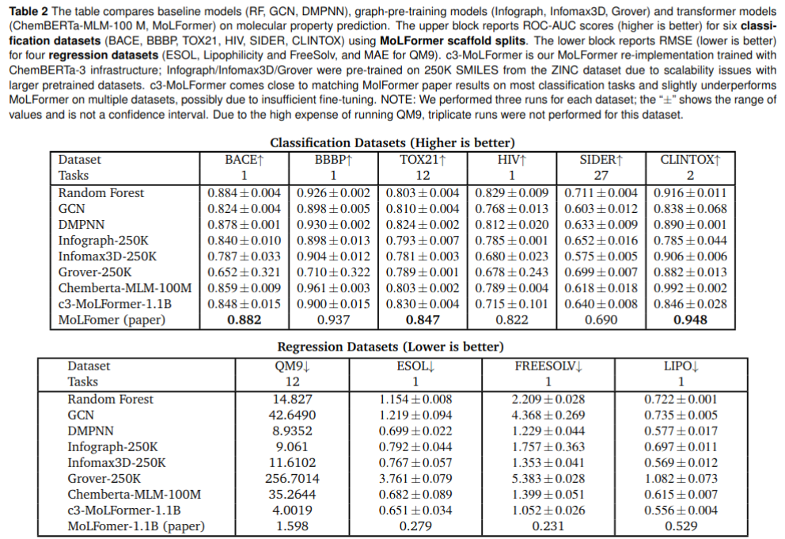
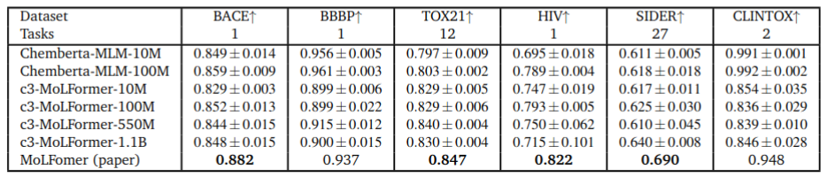
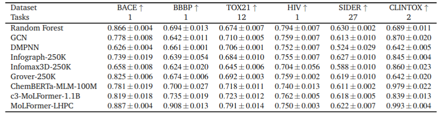
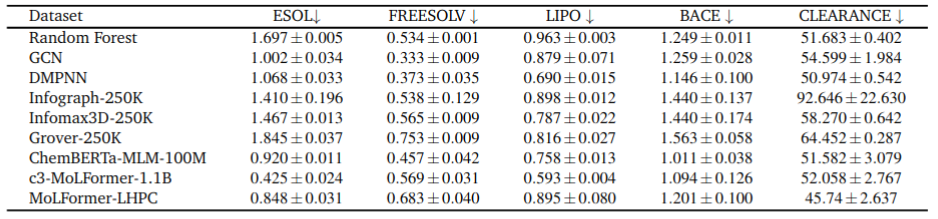
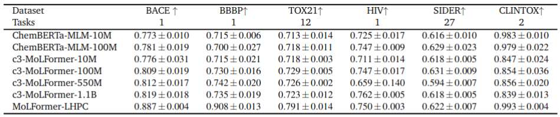

# ChemBERTa3
ChemBERTa-3: An Open Source Training Framework for Chemical Foundation Models

1. [Setup Environment](#setup-environment)
2. [Benchmark Models](#benchmark-models)
3. [Prepare Data](#prepare-data)
    1. [Pretraining Datasets](#pretraining-datasets)
    2. [Finetuning Datasets](#finetuning-datasets)
4. [Pretraining](#pretraining)
5. [Finetuning](#finetuning)
6. [Benchmark Results](#benchmark-results)
8. [Citations](#citatiobs)

## Setup Environment 

Clone the current repo as `git clone https://github.com/deepforestsci/chemberta3`.

The setup uses DeepChem and PyTorch, along with the additional python dependencies for running benchmarking tasks. Install the nightly version of DeepChem as `pip install --pre deepchem` and other dependencies via `requirements.txt` file as `pip install -r requirements.txt`

## Benchmark Models

We benchmarked a range of models in this study, categorized into two groups:

### Baseline models — 

1. [Graph Convolutional Network (GCN)](https://github.com/deepchem/deepchem/blob/master/deepchem/models/torch_models/gcn.py), 
2. Random Forest (RF), and 
3. [Directed Message Passing Neural Network (D-MPNN)](https://github.com/deepchem/deepchem/blob/master/deepchem/models/torch_models/dmpnn.py);

### Pretrained and advanced models — 

1. [InfoGraph](https://github.com/deepchem/deepchem/blob/master/deepchem/models/torch_models/infograph.py), 
2. [InfoMax3D](https://github.com/deepchem/deepchem/blob/master/deepchem/models/torch_models/gnn3d.py), 
3. [GROVER](https://github.com/deepchem/deepchem/blob/master/deepchem/models/torch_models/grover.py), 
4. [ChemBERTa](https://github.com/deepchem/deepchem/blob/master/deepchem/models/torch_models/chemberta.py), and 
5. [MoLFormer](https://github.com/deepchem/deepchem/blob/master/deepchem/models/torch_models/molformer.py).

This enables a clear comparison between traditional supervised learning approaches and more recent models leveraging unsupervised or self-supervised pretraining strategies. 

## Prepare Data

To run benchmarking tasks, data has to be prepared. This involves featurization of data points from SMILES strings into the corresponding representation for the model.
In some cases, it also involves preparing vocabulary for models which follow self-supervised learning approaches (ex: GROVER model).

For details on data preparation and featurization used across all models, please refer to the [Data Preparation README](chemberta3_benchmarking/data/data_preprocessing/readme.md).

This pipeline supports the following featurizers:

- CircularFingerprint (ecfp) – generates circular fingerprints by encoding atomic neighborhoods into fixed-length bit vectors for molecular similarity and structure-activity modeling
- DummyFeaturizer (dummy) – performs no featurization on the data 
- GroverFeaturizer (grover) – Prepares graph-based molecular features required by the GROVER (Graph Representation frOm self-superVised mEssage passing tRansformer) model.
- MolGraphConvFeaturizer (molgraphconv) – Converts molecules into graph convolutional formats with node and edge features for graph-based neural networks.
- RDKitConformer (rdkit-conformer) – Generates 3D conformers using RDKit and computes features suitable for 3D-aware models such as Infomax3D.
- DMPNN (dmpnn) – The D-MPNN featurizer generates graph-based molecular features using atom and bond representations inspired by the "Analyzing Learned Molecular Representations for Property Prediction" paper.

### Pretraining Datasets

ZINC20 is a chemical library containing 1.4 billion compounds, 1.3 billion of which are purchasable, sourced from 310 catalogs from 150 companies, specifically designed for virtual screening.
In our work, the models are pretrained across ZINC data sets of varying sizes to understand the impact of the scale of the data on model accuracy and generalization. Additionally,MoLFormer-c3-550M and MoLFormer-c3-1.1B are pre-trained on a combination of (50% ZINC20 + 50% Pubchem) and (100% ZINC20 + 100% Pubchem) datasets, respectively. 

### Finetuning Datasets

We utilize datasets from **MoleculeNet**, a benchmark suite designed to standardize the evaluation of machine learning models for molecular property prediction. These datasets span a diverse array of tasks, including **physicochemical property estimation**, **bioactivity prediction**, **toxicity assessment**, and **molecular generation**. Below is a summary of the datasets supported in our study, along with the number of molecules in each:

**Classification Datasets**

* **BACE\_C** – \~1,513 molecules; binary classification for binding affinity to human β-secretase 1.
* **BBBP** – \~2,039 molecules; binary classification task predicting Blood-Brain Barrier permeability.
* **ClinTox** – \~1,478 molecules; binary classification for clinical trial toxicity outcomes.
* **HIV** – \~41,127 molecules; binary classification for HIV replication inhibition.
* **Tox21** – \~7,831 molecules; multitask classification covering 12 toxicity pathways.
* **SIDER** – \~1,427 molecules; A multilabel classification dataset covering 27 adverse drug reaction categories for marketed drugs.

**Regression Datasets**

* **ESOL (Delaney)** – \~1,128 molecules; regression task for predicting aqueous solubility.
* **BACE\_R** – \~1,513 molecules; regression version of the BACE dataset.
* **Lipo** – \~4,200 molecules; regression task predicting the octanol/water distribution coefficient (logP).
* **FreeSolv** – \~642 molecules; A regression dataset of hydration free energies for small neutral molecules in water.
* **Clearance** – A regression dataset for predicting human metabolic clearance rates, used to assess pharmacokinetic modeling performance.

#### DeepChem scaffold splits

DeepChem’s implementation of ScaffoldSplitter follows the Bemis-Murcko scaffold-based approach to split molecular datasets. It groups molecules based on their core scaffold structures, ensuring structurally similar compounds remain together. The splitter prioritizes placing larger scaffold groups into the training set before allocating smaller ones to validation and test sets, promoting a more realistic evaluation of model generalization. For benchmarking using DeepChem splits, each dataset was split into 80/10/10 train/validation/test sets using the scaffold splitter. Table 6 compares the performance of models on the classification dataset splits using DeepChem scaffold splitter.

#### MoLFormer scaffold splits

To ensure consistency in evaluating our benchmarking platform with MoLFormer, we used the same scaffold splits from the MolFormer manuscript to benchmark models trained using ChemBERTa-3 architecture. Table 2 compares the performance of models on the classification and regression dataset splits provided by MoLFormer. As we discuss in the next section, MoLFormer’s scaffold splitting algorithm appears to differ significantly from
DeepChem’. The scaffold splits used in this study can be downloaded from `https://ibm.ent.box.com/v/MoLFormer-data`.

## Pretraining

The pretraining codes for the models 


## Finetuning/ Benchmarking

Triplicate runs were performed for various models using the following scripts. 

1. GCN - `./chemberta3_benchmarking/models_benchmarking/gcn_benchmark`
2. RF - `./chemberta3_benchmarking/models_benchmarking/rf_benchmark`
3. DMPNN - `./chemberta3_benchmarking/models_benchmarking/dmpnn_benchmark`
4. Infograph - `./chemberta3_benchmarking/models_benchmarking/infograph_benchmark`
5. Infomax3D - `./chemberta3_benchmarking/models_benchmarking/infomax3d_benchmark`
6. Grover - `./chemberta3_benchmarking/models_benchmarking/grover_benchmark`
7. ChemBERTa - `./chemberta3_benchmarking/models_benchmarking/chemberta_benchmark`
8. MoLFormer - `./chemberta3_benchmarking/models_benchmarking/molformer_benchmark`

The MoLFormer script used for benchmarking c3-MoLFormer is an adaptation of benchmark script given by MoLFormer
team.

To run triplicate benchmarks for a specific model, use the following command:

```bash
cd gcn_benchmark
bash gcn_classification_script.sh
```

## Benchmark results

### Using MoLFormer splits

Table 2 compares baseline models (RF, GCN, DMPNN), graph-pre-training models (Infograph, Infomax3D, Grover) and transformer models (ChemBERTa-MLM-100 M, MoLFormer) on molecular property prediction. The upper block reports ROC-AUC scores (higher is better) for six classification datasets (BACE, BBBP, TOX21, HIV, SIDER, CLINTOX) using MoLFormer scaffold splits. The lower block reports RMSE (lower is better) for four regression datasets (ESOL, Lipophilicity and FreeSolv, and MAE for QM9). c3-MoLFormer is our MoLFormer re-implementation trained with ChemBERTa-3 infrastructure; Infograph/Infomax3D/Grover were pre-trained on 250K SMILES from the ZINC dataset due to scalability issues with larger pretrained datasets. c3-MoLFormer comes close to matching MolFormer paper results on most classification tasks and slightly underperforms MoLFormer on multiple datasets, possibly due to insufficient fine-tuning. NOTE: We performed three runs for each dataset; the “±” shows the range of values and is not a confidence interval. Due to the high expense of running QM9, triplicate runs were not performed for this dataset.



Table 3 compares ChemBERTa and MoLFormer models pretrained on ZINC and PubChem datasets of varying sizes on various classification datasets and reports ROC AUC scores (Higher is better). We use MoLFormer scaffold splits. We have pretrained ChemBERTa models on the ZINC 10M and 100M dataset. Larger pre-training datasets appear to lead to slight improvements in downstream performance, but with diminishing returns. The scaling effect is not consistent; note the Chemberta-MLM-100M model outperforms the scores reported by MoLFormer 1.1B on BBBP and CLINTOX datasets. NOTE: We performed three runs for each dataset; the “±” shows the range of values and is not a confidence interval.




### Using DeepChem splits

Table 6 compares the different baseline models (RF, GCN, DMPNN, Infograph, Infomax3D, and Grover) to the transformer architecture models, ChemBERTa and MoLFormer, on various classification datasets and reports ROC AUC scores (Higher is better). We used the DeepChem scaffold splitter to split the datasets provided by MoleculeNet. Here, c3-MoLFormer indicates that the MoLFormer model is trained using Chemberta3
infrastructure and MoLFormer-LHPC is trained using the HPC clusters.



Table 7 compares the different baseline models (RF, GCN, DMPNN, Infograph, Infomax3D, and Grover) to the transformer architecture models, ChemBERTa and MoLFormer, on various regression datasets and reports RMSE(Lower is better). We used DeepChem scaffold splitter to split the dataset provided by MoleculeNet.



Table 8 compares the ChemBERTa and MoLFormer models pretrained on ZINC and PubChem datasets of varying sizes on various classification datasets and reports ROC AUC scores (Higher is better). We used DeepChem scaffold splits and pretrained ChemBERTa models on the ZINC 10M and 100M dataset.




## Legacy Code and Outdated Sections

This project evolved through several stages, and some parts of the codebase reflect earlier versions used during initial experimentation. While these sections are no longer actively maintained, they are preserved for transparency and reproducibility.

### Notes on Legacy Code
- Used for generating early results and prototypes.
- May not be compatible with the current codebase or environment.
- Not recommended for new experiments unless reproducing specific past results.

### Where to Find Legacy Code
- `chemberta3/` – Contains deprecated training and evaluation pipelines.
- The initial benchmark results can be found in `chemberta3/results` folder.

For all current workflows, refer to the updated scripts and documentation in the main directories.


## Citations
